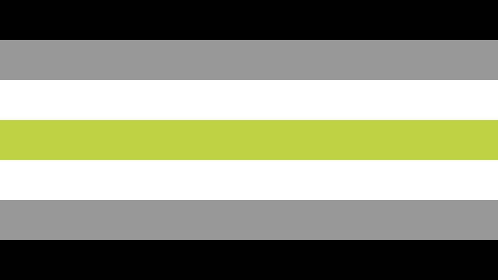

<link rel="stylesheet" href="/assets/css/style.scss">
 
<h1>about</h1>
hello i'm sev and i make flags 😎✌️

---------------------------

## names
- **sev**
- cass

---------------------------

## pronouns
- **he/him**
- **they/them**
- xe/xem
- vin/vins

---------------------------

## terms
- masculine and neutral

---------------------------

## pride flags
 **lesbian**  **nonbinary**  **transmasc**  **agender**  **genderfluid**  **oriented aroace** 

---------------------------

## twitter accounts

- [main account](https://twitter.com/theybian)
- [agender lesbian positivity](https://twitter.com/agenderlesbians) (bot)
- [nonbinary lesbian positivity](https://twitter.com/enbylesbians) (bot)
- [backup account](https://twitter.com/theybian1) (inactive)
- ask for priv

---------------------------

## links
- [redbubble](https://theybian.redbubble.com) *(buttons, stickers)*
- [curiouscat](https://curiouscat.com/theybian)
- [tiktok](https://tiktok.com/@sevsbian)
- [the thread of my flags](https://twitter.com/theybian/status/1308435954168979465?s=19)
- [the thread of my pride planets](https://twitter.com/theybian/status/1393646080659705861)
- [stream my song!](https://twitter.com/theybian/status/1300540997185810433)
- [my nonbinary lesbian flag](https://twitter.com/theybian/status/1403722750280220681)

